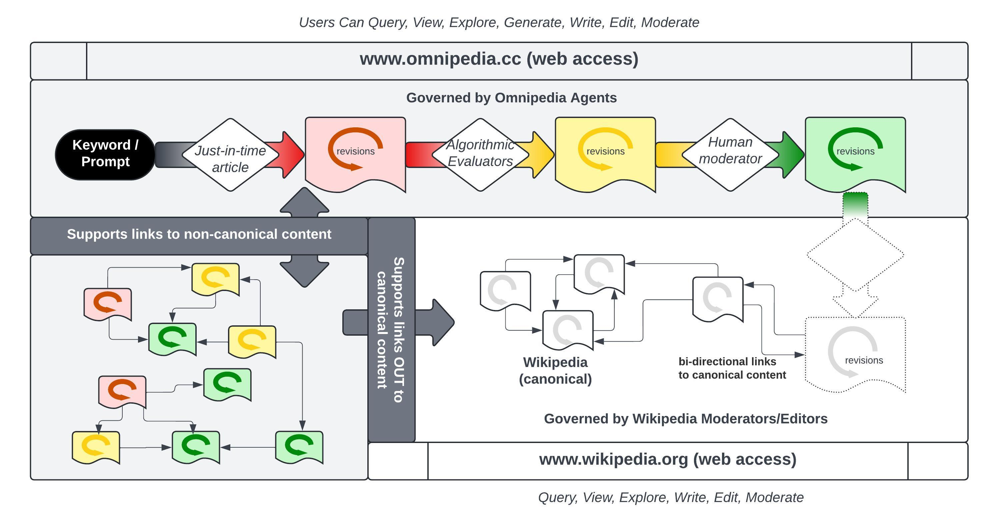

# Omnipedia

Scaling production, evalution, and refinement of frontier knowledge since MMXXIIII.

The omnipedia is a wiki for frontier knowledge which uses a mix of LLM (such as [storm](https://github.com/stanford-oval/storm/)) and editor input to create *just-in-time* articles in response to searches. Articles in omnipedia include incomplete, obscure, and unverified summaries of topics not covered by more reliable reference works. These are clustered and improved over time. To minimize the risk of confusion with reliable sources, omnipedia articles have colored backdrops.

- **Red:** newly AI generated pages start in the red category indicating that they should be targeted for editing, rather than for reading.
- **Yellow:** Yellow sections pass the letter of the rules for wikipedia articles but they may not pass the spirit of rules. Use with caution. Editors should focus on detecting and revising gaps between the letter and the spirit of the guidelines.
- **Green:** Green sections are vetted frontier knowledge, approaching the boundary of (but not necessarily satisfying) the criteria for wikipedia inclusion. Users are encourage to treat green articles as emerging knowledge.
- **White:** White sections are drawn verbatim from Wikipedia articles, and on hover indicate their source. 

Transition colors can indicate change in progress.
- **Red-to-Yellow:** Red sections are periodically evaluated by a battery of classifiers targeting various requirement derived from the wikipedia style guides. Articles that pass the automated tests are recategorized as yellow.
- **Yellow-to-Green:** Yellow sections are periodically evaluated by human moderators who manually verify whether the article does in fact satisfy the requirements. Once a moderator is satisfied that the requirements are met they can transition its color.
- **Green-to-White:** Omnipedia has no say in whether green articles get included in wikipedia but the Omnipedia system is designed to facilitate transfer of control of its pages to wikipedia should wikipedia moderators deem that transfer desirable. In general "inclusion" will look like partial integration of language or ideas in a section, along with some of its references, in a target article.

## Technical Approach

Omnipedia is BOTH a fork and a mirror of wikipedia

- Mirroring or transcluding canonical content and treating it as canonical (defering to wikipedia editorial process and governance of canonical content)
- [Forking]([url](https://en.wikipedia.org/wiki/Wikipedia:FAQ/Forking)) the software and social protocols to support frontier knowledge (retaining compatitability so that edit histories and other article provenance are legible/interoperable with wikipedia)
